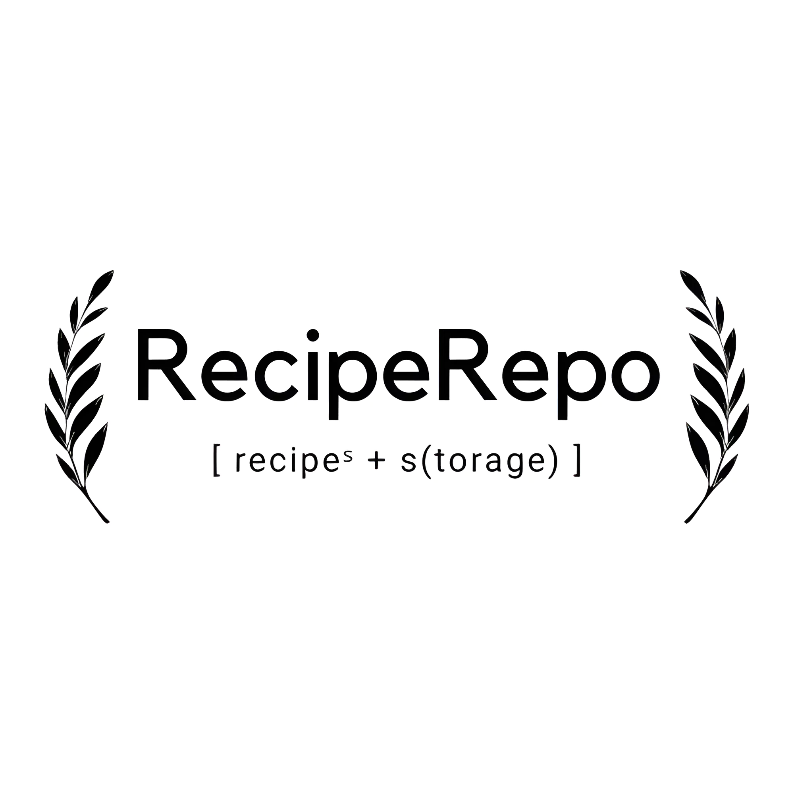

# Introduction

Recipe Repo is a website designed for user's to share their love for cooking and baking. You can see the live website [here](https://recipe-repo-2-e23f0ecfdc52.herokuapp.com/)

# Design
## Agile Strategy
The Agile methodology was used to plan and create this project. I used the Projects tool within GitHub to manage the different processes needed for this project to be completed.
You can see the project created [here](https://github.com/users/AlfredA93/projects/5)

- User Stories were created through GitHub Issues to highlight features for possible implementation.
- These User Stories were then assigned a label from these options - 'Could Have', 'Should Have' and 'Must Have'. These labels helped to prioritise which features needed to be implemented first.

After completing this project I saw the capability to use Epics (GitHub Milestones). These can give User Stories an overall theme to a group of User Stories - this is a feature within GitHub that I will research and use in future projects as I wasn't aware of this until after completing this project. The picture below is the Kanban board in progress.

### Project Goals
The goal of this project is to create a website for the cooking and baking community to come together and interact over online recipes. I am a keen cook and baker and have always wanted to share my recipes with friends and family alike, this website is the perfect opportunity to do this. This website is to meet a minimum of admin recipe creation and user comment/bookmark and like functionality. Further development goals are for users to submit their recipes.

### Scope
The scope of this project was large at the beginning. Due to having a deadline, certain features were assigned different priorities, to make sure that this project was finished in time with the user having the ability to interact with the site in a fully functional CRUD (Create, Read, Update & Delete) way.
So the plan for this project minimum (Must-Have) was as follows -
- Admin created recipes with full CRUD functionality from the backend
- Recipe List and Detailed Recipe webpages
- User account creation 
- User comments with full front-end CRUD functionality
- User likes with full front-end CRUD functionality
- User bookmarks with full front-end CRUD functionality

Once these objectives have been accomplished, we could work on expanding towards the 'Should Have' and 'Could Have' User Stories.
- User Recipes in full front-end CRUD functionality
- User 'My Recipes' webpages, where users can see, edit, delete their recipes in one simple easy place.
- Add Search Bar functionality
- Add Search by hashtag functionality
### Structure

The plan for the structure of this was as follows -

**At Minimum**
- Home Page, 5 Seasons Pages, 3 Account Pages - Login, Logout, Sign Up/Join Our Community
- Bookmarks Page visible only to logged in users

**Ideally (minimum plus...)**
- User dropdown menu
  - My Recipes
  - Bookmarks
  - Logout
- Add A Recipe page
- Search Bar
- Search by hashtag

### User Stories 

| Title | Number | Definition | Completed? | Label |
|-------|--------|------------|------------|-------|
| USER STORY: Create Landing Page | [#1](https://github.com/AlfredA93/recipe-repo-2/issues/1) | As a new site visitor I can easily identify website's aim so that decide whether to can stay or go | [x] | Must Have |
| USER STORY: Sign Up Form | [#2](https://github.com/AlfredA93/recipe-repo-2/issues/2) | As a new site visitor I can simply sign up to the website so that I can interact with the content | [x] | Must Have |
| USER STORY: Paginate Recipes | [#3](https://github.com/AlfredA93/recipe-repo-2/issues/3) | As a new site visitor I can clearly see paginated content so that I can click on the content I want | [x] | Must Have |
| USER STORY: Add bookmark functionality | [#4](https://github.com/AlfredA93/recipe-repo-2/issues/4) | As a authorised site visitor I can bookmark recipes so that I can view them in the future | [x] | Must Have |
| USER STORY: Add comment functionality | [#5](https://github.com/AlfredA93/recipe-repo-2/issues/5) | As an authorised site visitor I can comment on recipes so that I can interact with the community | [x] | Must Have |
| USER STORY: Add like functionality | [#6](https://github.com/AlfredA93/recipe-repo-2/issues/6) | As an authorised site visitor I can like recipes so that the author knows this is a recipe I like | [x] | Must Have |
| USER STORY: Manage Recipe Posts | [#7](https://github.com/AlfredA93/recipe-repo-2/issues/7) | As an admin I can create, read, edit/update and delete recipes so that I can manage my content | [x] | Must Have |
| USER STORY: Add tags to recipes | [#8](https://github.com/AlfredA93/recipe-repo-2/issues/8) | As a site user I can see tags on recipes so that I can associate the recipes with a category or theme | [x] | Could Have |
| USER STORY: View Likes | [#9](https://github.com/AlfredA93/recipe-repo-2/issues/9) | As an admin/site user I can see likes so that I can see how popular a recipe is  | [x] | Must Have |
| USER STORY: View Comments | [#10](https://github.com/AlfredA93/recipe-repo-2/issues/10) | As an admin/site user I can read comments so that I can see what the community thinks about recipes | [x] | Must Have |
| USER STORY: Season Pages | [#11](https://github.com/AlfredA93/recipe-repo-2/issues/11) | As a user I can click on different pages in the navigation so that I can see the recipes organised by season | [x] | Could Have |
| USER STORY: Recipe Detailed Page | [#12](https://github.com/AlfredA93/recipe-repo-2/issues/12) | As a user I can click on the recipe card to open a detailed page of the recipe so that I can see the full recipe | [x] | Must Have |
| USER STORY: View Tags and Search via Tag | [#13](https://github.com/AlfredA93/recipe-repo-2/issues/13) | As a user I can see and click on a tag/hashtag so that see similar recipes with the same tag | [x] | Could Have |
| USER STORY: Edit and Delete Comments | [#14](https://github.com/AlfredA93/recipe-repo-2/issues/14) | As a user I can edit or delete my comments so that I can update my comments if I need to | [x] | Must Have |
| USER STORY: Bookmarks Page | [#15](https://github.com/AlfredA93/recipe-repo-2/issues/15) | As a user with an account I can see a page where my bookmarks are stored so that I can easily find the recipes I save | [x] | Must Have |
| USER STORY: User Dropdown Nav Menu | [#16](https://github.com/AlfredA93/recipe-repo-2/issues/16) | As a user I can click on my name in the navbar so that access recipes related to my user data | [x] | Should Have |
| USER STORY: Add a user recipe | [#17](https://github.com/AlfredA93/recipe-repo-2/issues/17) | As a user I can create a recipe to submit on the website so that I can share my recipes with the community | [x] | Should Have |
| USER STORY: Edit/Delete User Recipe | [#18](https://github.com/AlfredA93/recipe-repo-2/issues/18) | As a user I can edit or delete recipes that I have created so that I can correct any errors or remove recipes I don't want anymore | [x] | Should Have |

### Other Design Aspects

The color schemes for the user interface were inspired by these palettes. Buttons, Nav bar, footer colours all come from these.

### Wireframes

When Designing my Models I originally wanted to have bookmarks and ingredients as seperate Models, however this didn't make much sense the further into the project I went, so I decided to add these as fields in Recipe Model.

# Features
#### Nav Bar
- The Navigation Bar is responsive and changes between an inline list to a burger icon depending on screen size

- RecipeRepo Logo - This takes us to the home screen
- Seasons Pages - This takes us to a page for each season, where the recipes are filtered

  - All Seasons - for all recipes on the website
  - Spring - Recipes for Spring
  - Summer - Recipes for Summer
  - Autumn - Recipes for Autumn
  - Winter - Recipes for Winter

- Login - This is where users who already have an account can sign in.
- Join Our Community - This is where users who are new to the website can sign up for an account.
- Search Bar - This is where the user can search through all the recipe titles for a specific recipe.

#### **Nav Bar (when signed in)**

- User Dropdown Menu
  - Bookmarks - Here the user can find all the recipes they have bookmarked
  - My Recipes - This is where the user can find all the recipes that they have created themselves.
  - Log out - This is where the User can log out of their account

#### Home Page
- This is the landing page for the website. Users are encouraged to sign up with the drop-down accordion bars on the page.

- The users also see a list of the most recent recipes submitted to the website

#### Recipe Detail Page
- This is where the users can see the full recipe breakdown.
- Users can comment, like and bookmark the recipe.
- Users can edit or delete their comments, but not those from other users (only the admin has that capability)

- Comment

- Edit Comment

- Delete Comment

#### Season Pages
- These show a filtered set of recipes corresponding with the appropriate season they are assigned during the recipe upload process. The All Seasons page is only filtered by published recipes, so this page includes the entire collection of the site's recipes.
- All Seasons

- Spring Season

- Summer Season

- Autumn Season (shown in responsive design section within [TESTING](TESTING.md))
- Winter Season

#### Join Our Community
- This is the signup form for new users
- It has built-in password validation from Django AllAuth library 

#### Search Bar
- This search bar searches through all of the recipe titles and displays matching results in a separate webpage.
- From here they can access the same functionality as on the recipe cards as in the Seasons and Home page.

#### Hashtag search
- If users click on a hashtag, they are taken to a separate webpage that displays a list of all the recipes with the same tag.
- From here they can access the same functionality as on the recipe cards as in the Seasons and Home page.

#### Log In
- This is the form where users can sign into their account

#### Custom Error Page (also referenced in [TESTING](TESTING.md))
- 404 Error Page for when the user accidentally types in an url path that doesn't exist on our website.

#### Pagination
- Users can go through pages of recipes on the home screen and through their bookmarks. The page button appears in the button right of the screen.

- Bookmarks page pagination

### Once the User has signed up they can now view these pages below -

#### Log Out
- This is the form where users can sign out of their account

#### Add A Recipe
- This is where the users can add their recipes

#### My Recipes
- This is where users can see the recipes they have created
- They can see the amount of bookmarks and likes each recipe has
- Whether it is in Draft or Published - if published, it shows the likes/bookmarks
- They can edit or delete each recipe by clicking on the icons

- Edit Recipe

- Delete Recipe

#### Bookmarks
- This is the webpage where users can find all the recipes they've bookmarked for future use.
- They can click on the bookmark icon to un-bookmark it if they no longer wish it saved in the list

## Message Alerts
Message alerts are present throughout all user interactions with the website. They appear as below and also when errors occur, the error messages are listed in [TESTING](TESTING.md) 
- Bookmark Add

- Bookmark Remove

- Comment Add

- Comment Delete

- Comment Update

- Like Add

- Like Remove

- Recipe Add

- Recipe Delete

- Recipe Update

- User Log in

- User Log out

## Future Features

- Email Notifications for new recipes/comments/email verification
- Profile Pages with pictures
- Personal User Profile feeds, updating in realtime

# Testing
### Please see [TESTING](TESTING.md) page for all details on testing and validation.
# Deployment
I deployed the app using the website Heroku, which hosts internet applications.

I used ElephantSQL to set up a free cloud database with them. Set up an account with ElephantSQL and then follow these steps.
- Click Create New Instance to create a new database.

- Choose your location and name.

- Finalise setup
- Copy over your URL and add this to your application IDE in your env.py, remember to keep this secret.

 Set up an account with Heroku, then follow these steps for deployment -
- Create an app
- Name the app
- Connect the app to GitHub and find the repository which you'd like to connect with.
- Head over to the settings tab and find the Config Vars. Add the config vars appropriate to the app. In this case, it is PORT, ALLOWED_HOSTS, SECRET_KEY, CLOUDINARY_URL and DATABASE_URL.

- **Before your final deployment you must set DEBUG = False within your IDE, so to make sure that your code is safe and the site works as intended with any 404 pages working correctly. Once this has been make, you can make your final `push` to your GitHub Repository**
- Switch back to the Deploy tab and half way down the page you can select automatic deploys. When this is active, whenever a new edit is received by GitHub, Heroku also updates the application and builds a new deployment. Once this has been checked, click the deploy branch button at the bottom and await for the domain URL to be generated.

 # Libraries Used and Why?
- Django Quill Editor
  - This allows the user to create text in a much more flexible format, they can choose to add bold, emphasis and other types of text formatting to display their text in the desired way.
- AllAuth
  - This Library allows for easy integration of accounts and account validation into the website.
- Django
  - This framework helps to easily create a full-stack project and has a lot of supportive documentation which helps greatly with implementation.
- Bootstrap
  - This framework allows for easy and quick element styling.
- Django Taggit
  - This allows users to create tags for posts, in this case, recipes, which can then be searched/queried.
- Cloudinary
  - Media and Static storage

 # Credits
Many thanks to both Code Institute and my mentor Alex K, I learnt a lot throughout this project and understand that this is just the tip of the iceberg. I used Stack Overflow a lot in this project to help understand some of the errors I was making, along with discovering whether certain ideas were possible.
 ## Code

 1. [Nav Bar Styling](https://stackoverflow.com/questions/39639264/django-highlight-current-page-in-navbar) - Using template tags to implement the active bootstrap class.
 2. [Saving form images to DB field](https://stackoverflow.com/questions/29171077/imagefield-not-saving-images-in-modelform-django-python) - Add 
`enctype='multipart/form-data'` to the form attributes
3. [Accessing user whilst in ListView](https://stackoverflow.com/questions/33809345/how-to-access-current-user-in-django-class-based-view) - how to access a queryset within a class-based view - `ListView`
4. [Regex Validation Expression](https://stackoverflow.com/questions/13283470/regex-for-allowing-alphanumeric-and-space) - This expression was used to help validate the title field in the `RecipeModel` in Models.py file, to make for easy pre-population of the slug field - `regex=r'^[\w\-\s]+$',`
5. [If Queryset Empty](https://stackoverflow.com/questions/1387727/checking-for-empty-queryset-in-django) - used in search.html if statement
6. [Django Taggit Tutorial](https://dev.to/thepylot/how-to-add-tags-to-your-models-in-django-django-packages-series-1-3704) - This tutorial helped me to set up Django Taggit for Models and the tag search feature
7. [Responsive Squares](https://stackoverflow.com/questions/20456694/grid-of-responsive-squares) - This link helped me keep a 1:1 aspect ratio for the Recipe Cards
8. [Non-Case Sensitive Search](https://stackoverflow.com/questions/12132368/django-queryset-contains-case-sensitive) - This link helped me find the correct syntax for searching without case sensitivity
9. [HTTP Referrer](https://stackoverflow.com/questions/4406377/django-request-to-find-previous-referrer) - Alex my mentor helped me find out the code needed to request the site referrer. This was used in views.py RecipeBookmark so that a user can bookmark a page and it would just reload the current page instead of directing to a set url
10. Text within the headings of the Seasons Pages was found at [RHS](https://rhs.org.uk) and [Squires Garden Centre](https://www.squiresgardencentres.co.uk/) which was adding to by my own personal knowledge of which veg are in season at which time.

 ## Helpsheets, Documentation and Useful Resources
- [Bootstrap Documentation](https://getbootstrap.com/docs)
- [Django Documentation](https://docs.djangoproject.com/)
- [Django Quill Editor Documentation](https://pypi.org/project/django-quill-editor/)
- [Further Django Quill Editor Docs](https://django-quill-editor.readthedocs.io/en/latest/pages/using-in-admin.html)
- [Django Taggit Documentation](https://django-taggit.readthedocs.io/en/latest/)
- [Django AllAuth Documenation](https://django-allauth.readthedocs.io/en/latest/)
- [WhiteNoise Documenation](https://whitenoise.readthedocs.io/en/latest/index.html)
- [Regex Documentation](https://docs.python.org/3/library/re.html)
- [UpdateView & DeleteView Django Documentation](https://docs.djangoproject.com/en/4.2/ref/class-based-views/generic-editing/)
- [Styling Forms](https://stackoverflow.com/questions/61860145/django-adding-custom-css-in-updateview) with attribute `widgets`
- [Codemy YouTube Channel](https://www.youtube.com/c/Codemycom) - This channel helped me understand many aspects of Django, as follows: 
  - [Form Styling](https://www.youtube.com/watch?v=CVEKe39VFu8&list=PLCC34OHNcOtqW9BJmgQPPzUpJ8hl49AGy&index=7)
  - [Edit and Delete A Model Field](https://www.youtube.com/watch?v=jCM-m_3Ysqk)
  - [Search Bar](https://www.youtube.com/watch?v=AGtae4L5BbI)
- [Regex Explained YouTube Video](https://www.youtube.com/watch?v=FY9W3MN8jBQ)
- [Editing a success url](https://stackoverflow.com/questions/24822509/success-message-in-deleteview-not-shown) - This webpage helped me understand `get_success_url`
- [Add & Delete Comments in Django YouTube Video](https://www.youtube.com/watch?v=MmLRE2fCcec)
- [Attributes of TextArea](https://www.w3docs.com/snippets/html/how-to-set-the-size-of-the-textarea-element.html) in forms

 ## Technology
 - [Tiny-img](https://tiny-img.com/webp/) - webp image convertion
 - [Canva](canva.com) - Logo design
 - [Pixelcut Image Upscaler](https://create.pixelcut.ai/upscaler) - Logo upscaler
 - [Background Remover](https://www.remove.bg/) - Logo white background remover
 - [Favicon Creator](https://formito.com/tools/favicon) - Favicon Icon
 - [Colour Palettes](https://mycolor.space/?hex=%23E9ECEF&sub=1) - UX Design
 - [Dopely Colors](https://colors.dopely.top/inside-colors/40-elegant-color-palettes-with-their-gradients/) - UX Design
 - [Django Key Generator](https://djecrety.ir/)
 - [ElephantSQL](https://elephantsql.com)

 ## Media
 - All pictures submitted from users Alfred and Harry were sourced from [Unsplash](https://unsplash.com/) under their free license.

 ## Recipes

 All recipes submitted by authors Alfred and Harry were written by myself, Alfred Ayre with recipe images from unsplash.

 # Learning Outcomes
I have learned so much throughout this project. The amount of features and the flexibility that the Django Framework offers is exciting and a little overwhelming as a new developer. However, the CodeInstitute, Stack Overflow, YouTube and online communities were brilliant at explaining some of the features. I conducted this project in a short amount of time, only 3 weeks and I am excited to continue learning with Django in the future, as this project has only a thimble of features within a sea of possibilities that Django offers. Further development on this project is something I would like to do in the future. I felt personally upset that I wasn't able to fix the errors introduced by the external libraries, however, I am understanding that this is part of a developer's career and all part of the journey in learning and improving. These errors are good to humble me and steadily improve myself as a developer.

 # Acknowledgements
 Thank you so much to the following people who have all played a part of making this project possible.
 - My Wife, Sabrina for her continual support and encouragement.
 - Alex K, my mentor for his brilliant and consistent support. His knowledge, patience and dedication to the coding community is commendable and he deserves every success in his life.
 - Matt Rudge and the whole Team at CodeInstitute, they've been brilliant at teaching and offering support through their slack community, they teach the materials in a fun and interesting way.